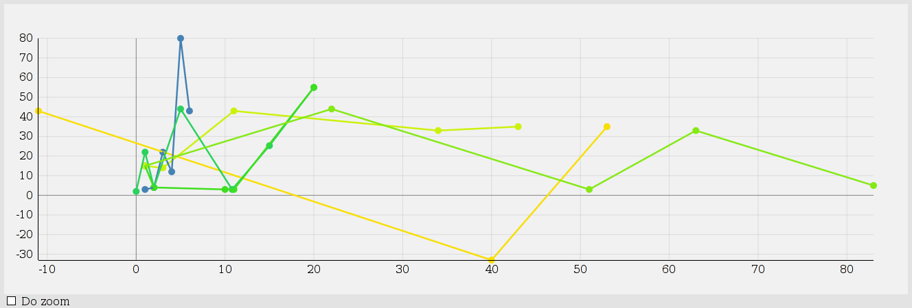

# SkyLine

SkyLine is a D3.js-based multi-line plotting component for small and larger
datasets. It adapts to the size of the data, comes with zooming and panning
support, includes a tooltip and is freely customizable.

## Usage

1. Include
[D3.js](https://github.com/mbostock/d3/)
.
2. Include `skyline.js`
3. Instanciate `SkyLine` and call its `plot` method:

        var lineChart = new SkyLine('#line-chart', {data: data});
        lineChart.plot();

SkyLine takes a D3.js-selector string (e.g. `'#line-chart'`, `'.chart'` or
`'body div'`) which specifies the element the chart (a single `svg` element)
should be appended to and it takes an object full of options (data,
width, height etc.).

## Options

Here is a sample invocation with all available options:

        new SkyLine('#line-chart', {
          data: [         // An array full of arrays full of x/y value pairs
            [             //   each representing a line (required argument)
              [1, 3] [2, 4], [3, 22], [4, 12], [5, 80], [6, 43],  // Line 1
            ],
            [
              [0, 2], [1, 22], [2, 4], [5, 44], [10.8, 3], [15, 25.3],  // Line 2
            ],
            [
              [1, 15], [2, 4], [10, 3], [11, 3], [20, 55],  // Line 3
            ]
          ]
        
          width: 800,             // The width of the graph
                                  //   (default: `800')
          height: 300,            // The height of the graph
                                  //   (default: `300')
          knobs: true,            // Whether to use knobs (x/y value markers) or not
                                  //   (default: `true')
          zoom: false,            // Whether to make the plot zoomable or not
                                  //   (default: `false')
          scatter: false,         // Whether to plot a scatter plot or not
                                  //   (default: `false')
          knobRadius: 5,          // Radius of an individual knob
                                  //   (default: `5')
          threshold: 50,          // Max. data points threshold
                                  //   (default: `50')
          tooltip: {              // Custom tooltip style rules
            'stoke': '#FF0000',
        }

## The data

The `data` attribute is a three arrays deeply nested array. Each
first-level inner array represents a line containing individual arrays
with each two integers or decimals representing a x/y point.

## Automagic

SkyLine adapts to the size of your data. For small datasets knobs are shown
and lines are thicker. For larger datasets lines are smaller and knobs are
neither shown, nor appended to the SVG (faster + looks cleaner).

`threshold` marks the border between a small and a large dataset. It
indicates the number of all x/y data points in all lines given in the
`data` attribute (default value: 50).

## Knobs, Tooltip, Zooming and Customization

**Knobs**

The `knobRadius` option specifies the radius of an unhovered knob. The line
thickness is adapted accordingly as a fraction of the knob radius. If
`knobs` is `false`, SkyLine will plot lines without knobs even for small
datasets.

**Tooltip**

When hovering over a knob, a tooltip displaying the x and y value of the
current data point is shown. The tooltip can be styled using the `tooltip`
option. User-defined tooltip styles have precedence over built-in ones.

**Zooming**

SkyLine comes with built-in zooming/panning support. The `zoom` options
indicates if a graph should be zoomable when it is first plotted
(default: `false`).

Each graph object exposes two functions `enableZoom` and `disableZoom` to
dynamically make a plot zoomable/unzoomable. Here is an example:

        var lineChart = new SkyLine('#my-chart', {data: myData})
        lineChart.plot();
        
        document.getElementById('#enable-zoom-button').onclick = function() {
          lineChart.enableZoom();   // Enable zooming
        }
        
        document.getElementById('#disable-zoom-button').onclick = function() {
          lineChart.disableZoom();  // Disable zooming
        }

**Customization**

Apart from the explicite tooltip styling, you can use the usual styling
classes that D3.js exposes for its auto-generated elements (e.g.
`.tick text`). SkyLine does not obstruct them. The elements are plain-old
SVG elements generated using D3.js. So you can select tham using D3.js's
`select` and `selectAll` and act on them like they were your own graph.

## Scatter Plots

If the `scatter` options is `true`, a scatter plot will be drawn instead of
a line graph. The size of each data point marker can be set using the
`knobRadius` attribute. SkyLine will adapt to larger datasets by shrinking
the markers if the total number of data points is greater than `threshold`.

The `knobs` options has no effect when `scatter` is `true`.

## More Features

- Multiple lines
- Grid
- Automatic scaling (any plot size possible)
- Automatic zero-line markers
- Bring line to foreground on hover
- Make line thicker on hover
- Automatic colorization
- Negative values
- Decimal numbers
- ID-less (no HTML `id' attributes used)
- Typical D3.js element classes (ticks text etc.) preserved
- Subtle, unobtrusive animations
- Deep zoom (0 - 100 interpolation)
- Automatic pointer adjustment
- Auto-rescaling to non-zoom state when fully zoomed out so the
  graph does not get hidden by accident
- Public interface: `enableZoom'/`disableZoom'; zoom can be
  dynamically enabled/disabled (e.g. toggle buttons) so that one can
  seamlessly scroll over plots without triggering the zoom when using the
  scroll wheel/swipe gestures
- Automatic scaling of the x/y axes
